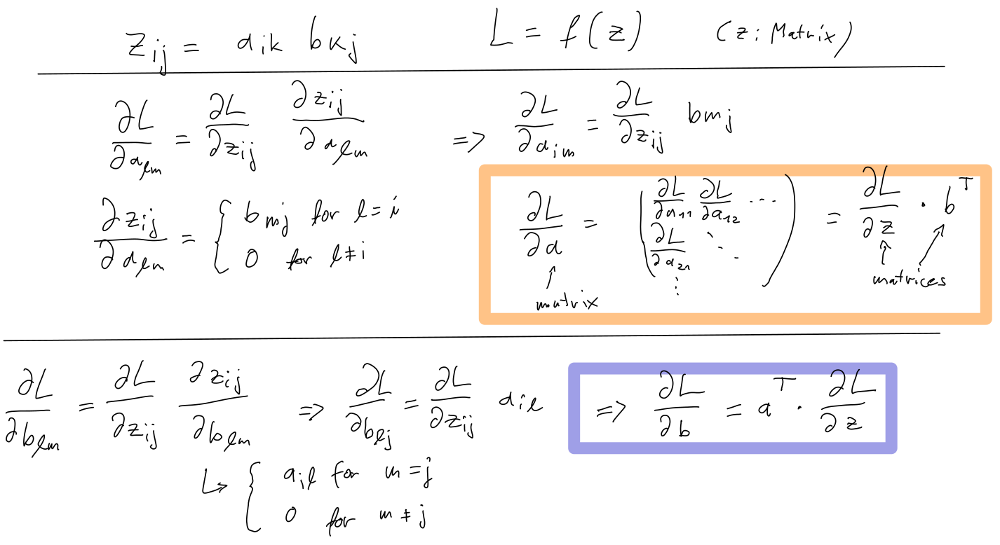

# Exercise 1

We have 2 inputs, 32 hidden neurons, 1 output. Every neuron has a bias, that leaves us with

```python
(
    2 * 32 # hidden layer weights
    + 32 # hidden layer biases
    + 32 * 1 # final layer weights
    + 1 # final layer bias
) # = 129
```

parameters. Programatically we can count them with

```python
sum(par.numel() for par in model.parameters())
```


# Exercise 2

For a matrix multiplication `z = a @ b` we will get

```python
da = dz @ b.T
db = a.T @ dz
```

So

```python
dw2 = a1.T @ dz2.unsqueeze(1)
```

and

```python
da1 = dz2.unsqueeze(1) @ w2.T
```

and

```python
dw1 = X.T @ dz1
```



# Exercise 3

In the initialization part, add parameters for the biases

```python
b1 = torch.randn(neurons) * 0.1
b2 = torch.randn(1) * 0.1
```

The forward pass is modified to include the bias

```python
z1 = X @ w1 + b1
...
z2 = a1 @ w2 + b2
```

In the backward pass we need

```python
...
db2 = dz2.sum(axis=0)
...
db1 = dz1.sum(axis=0)
```

And finally we also need to include the biases in the gradient update

```python
for par, grad in [(w1, dw1), (w2, dw2), (b1, db1), (b2, db2)]:
    par.add_(-lr * grad)
```

# Exercise 4

Modify the forward pass to include the sigmoid activation

```python
a2 = z2.sigmoid()
loss = torch.mean((y - a2) ** 2) # same, just replaced z2 by a2
```

In the backward pass we need to include the derivative of the sigmoid function as well:

```python
da2 = - 2 / len(a2) * (y - a2) # same, just replaced z2 by a2
dz2 = da2 * a2 * (1 - a2) # derivative of sigmoid: f'(x) = f(x) * (1 - f(x))
```

For visualization we also need to include the sigmoid function in the forward pass, so replace the first argument of `visualize_classifier` by

```python
lambda x: torch.sigmoid(torch.relu(torch.tensor(x, dtype=torch.float32) @ w1 + b1) @ w2 + b2)
```

# Exercise 5

In the forward pass, change the loss to

```python
loss = -torch.mean(y * torch.log(a2) + (1 - y) * torch.log(1 - a2))
```

In the backward pass, the derivative of the loss becomes

```python
da2 = -1 / len(a2) * (y / a2 - (1 - y) / (1 - a2))
```
